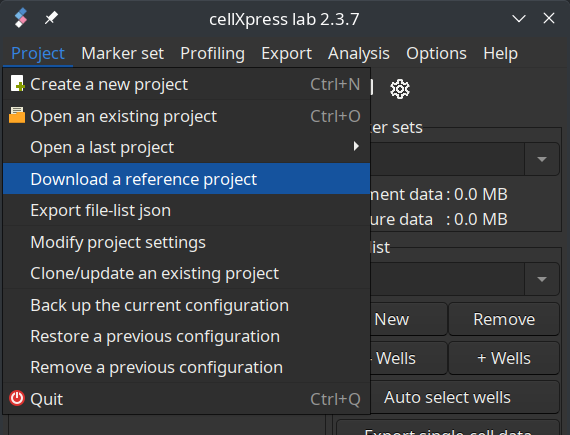
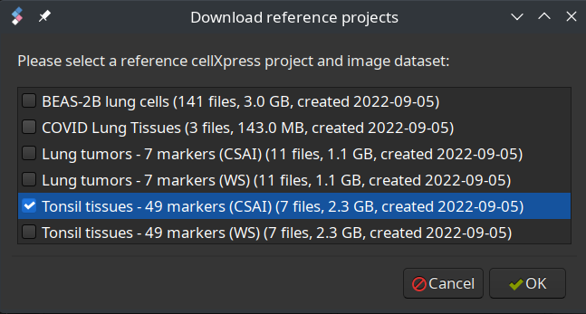

# Tissue Segmentation Benchmark 2022 <!-- omit in toc -->

Python scripts to compare the segmentation results from cX2 and various other
tools.

- [Introduction](#introduction)
- [Installing the reference data sets](#installing-the-reference-data-sets)
- [Perform tissue segmentation](#perform-tissue-segmentation)
- [Runnning the benchmark](#runnning-the-benchmark)

-------------------------------------------------------------------------------

## Introduction
cX2 is designed for biologists with limited programming/scripting experience, and thus all algorithms are built-in and can be configured and visualized via GUI. 

However, many existing MxF analysis software tools are designed for advanced users with computational knowledge. These tools usually only include rudimentary built-in and GUI-based analysis functions, and require heavy custom scripting and/or external third-party libraries to fully utilize their analysis capabilities. 

cX2 has completely different intended users and design philosophy than these tools and is not meant to replace them. Thus, the purpose of our benchmark is to not to assess the full potential of these other software tools, but rather to determine their expected performance when used by cX2’s intended users.

## Installing the reference image sets
1. Assuming the project root directory is `/home/user/projects`
   (You may substitute it with your own root directory location).

2. Clone the repo using Git under the project root directory.
   ```
   git clone https://github.com/ccpa/mxspa /home/user/projects
   ```

3. Download and install cellXpress 2 (cX2) from http://www.cellXpress.org

4. Run cX2 and make sure the project root path is point to
   `/home/user/projects`.

5. Download the four reference cX2 projects and images directly using cX2.   
   <p align="center">
   <br>
   
   <p>

## Perform tissue segmentation
We closely followed the official documentations of these other software tools and used their recommended analysis procedures and settings. If clear installation instructions of external libraries or exemplary scripts were provided, we would follow these instructions and used these scripts. Otherwise, we would just use their built-in analysis functions with reasonably tuned parameters.

Instructions to perform cell or tissue segmentation:
1. [CellProfilter](./Software_Projects/CellProfiler/README.md)
2. [QuPath](./Software_Projects/QuPath/README.md)
3. [DeepCell](./Software_Projects/DeepCell/README.md)

## Runnning the benchmark
1. Install required python libraries

   ```
   pip3 install --user matplotlib scipy h5py numpy roifile opencv-python tiffile cmapy pandas imagecodecs
   ```

2. Update the location of benchmark data at segmentation_benchmark.py

3. Run the benchmark comparison code
   ```
   python segmentation_benchmark.py
   ```

4. The segmentation boundaries are saved under `figures`, and the raw
   performance values are saved under `results`
