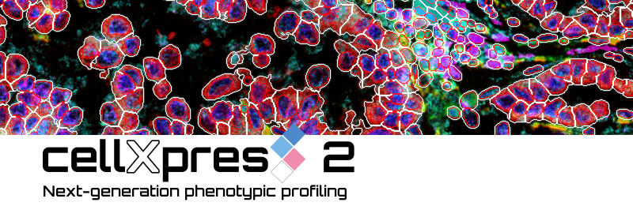

# cellXpress 2 Pytyon Library (pycXlib)

Open-source Python library for accessing and analyzing cellXpress 2 data

## Usage
1. Import the library
    ```python
    ### Setup the paths
    import sys
    from pathlib import Path
    repo_root = Path(__file__).absolute().parents[2]
    python_lib_root = repo_root / 'PythonLib'

    ### Add python_lib_root to the system search path
    sys.path.append(str(python_lib_root))

    ### Load the libraries
    from pycXlib.benchmark import *

    ### All the functions will be available
   ```

## Licenses

pycXlib is released under the [Apache 2.0 license](./LICENSE).