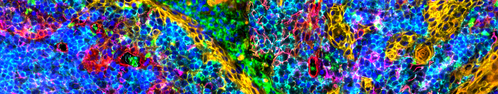
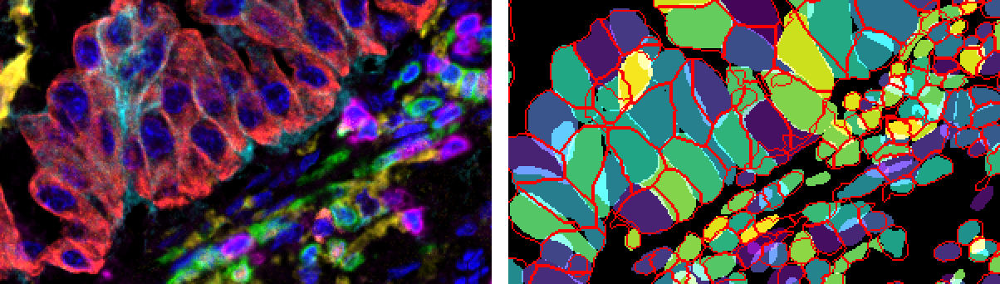

# Multiplex Spatial Analysis (MxSPA) Toolbox <!-- omit in toc -->

<p align="center">
    
</p>

- [Introduction](#introduction)
- [Components](#components)
- [Installation](#installation)
- [Acknowledgement](#acknowledgement)
- [Licenses](#licenses)

## Introduction

MxSPA toolbox is a collection of Python/R scripts and reference data for
benchmarking and analyzing next-generation multiplex spatial image and data.
Our objective is to enable unbiased, systematic, and reproducible analyses of 
single-cell spatial data (RNAs, proteins, and metabolites).

<p align="center">
    <br>
    <em>Segmentation accuracy evaluation using the MxSPA Toolbox</em>
</p>

## Components
* General scripting libraries
    * [pycXlib](./PythonLib/pycXlib/README.md) - Python library for accessing and analyzing cellXpress 2 data

* Reference data sets
    * Segmentation annotations in ImageJ ROI format for the following data sets:
        | Data set name      | Marker number | Imaging/staining method | Year  |
        |--------------------|:-------------:|----------------|-------|
        | [BEAS-2B lung cells](./Reference_data/Annotations/2022_BEAS2B_Lung_Cells/) | 4 | IF | 2022  |
        | [COVID lung tissues](./Reference_data/Annotations/2022_COVID_Lung_Tissues/) | 4 | PANINI | 2022  |
        | [Lung tumors](./Reference_data/Annotations/2022_Lung_Tumors/) | 7 | Vectra Polaris | 2022  |
        | [Tonsil tissues](./Reference_data/Annotations/2022_Tonsil_Tissues/) | 49 | CODEX | 2022  |

* Projects using the MxSPA Toolbox
    * [Tissue segmentation benchmark of cellXpess 2, DeepCell, QuPath, and
      CellProfiler (2022)](Projects/2022_Segmentation_Benchmark/README.md)
    * [FlowSOM clustering of cellXpress 2 data (2022)](Projects/2022_FlomSOM_Clustering/)
    * [Cell-type distribution plots based on FlowSOM clustering results (2022)](Projects/2022_CellType_Distribution/)

## Installation
1. To clone the MxSPA toolbox to your project folder
   ```bash
   $ cd /home/user/projects
   $ git clone https://github.com/cellXpress/mxspa mutliplex_toolbox
   ```
2. To update the local repo
   ```bash
   $ git pull
   ```

## Acknowledgement

Please cite the following publication if you use MxSPA toolbox and/or data:
* Spatial and phenotypic profiling of diverse cell types in highly-multiplexed
  fluorescence tissue images with cellXpress 2, Lee et. al., (under review)

The following labs contributed to the development of the toolbox
|Contributors    | Organizations                              |
|----------------|--------------------------------------------|
|Lit-Hsin Loo (PI)<br> Joey Lee Jia Ying | Complex Cellular Analysis Group,<br>Bioinformatics Institute (BII), A*STAR, Singapore|
| Sizun Jiang (PI)<br> Yao Yu Yeo | Jiang Lab at BIDMC,<br>Harvard Medical School, USA|

## Licenses

MxSPA Toolbox is released under the [Apache 2.0 license](./LICENSE).<br>
All images and data files are released under the 
[Creative Commons BY-NC-ND 4.0 license](https://creativecommons.org/licenses/by-nc-nd/4.0/).
